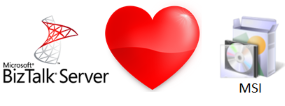

<strong>We think MSI files are great should be smoother to use when developing for BizTalk Server.</strong> MSI:s provides an easy way to package a set of files and adds extra goodiness to ease deployment - especially when using BizTalk Server.
 

Traditionally the way to package BizTalk artifacts to an MSI involved installing the artifacts to a BizTalk Server and exporting them.

<strong>BtsMsiTask however provides a way to package compiled artifacts directly into a MSI, without having to first installing them to a BizTalk Server.</strong> <a href="https://github.com/riha/BtsMsiTask">Open source</a> and <a href="{{ site.latest_download }}">free</a>.

## How does it work?

BtsMsiTask uses the exact same techniques as BizTalk Server does when exporting a MSI from the server. 
By reverse engineering we extracted the functionality and wrapped it in a stand alone library, not tied to the BizTalk Server infrastructure in any way.
Any complied dll can now directly be packages into a BizTalk specific MSI.

In BtsMsiTask project we choose to package the functionality as a MsBuild task. This reason for this is that it suited our needs to use in a build server scenarion.

TODO: Skall ha en enkel bild som visar två dll:er som man ksickar in till msbuild och som sen bara blir en msi och in till biztalk.

## Getting started

Getting started using BtsMsiTask involves three simple steps.

**1. Download and install**

BtsMsiTask is delived as a installer that can be [downloaded here]({{ site.latest_download }}). 
Running it will by default try and install the binaries that MSBuild task in the default MsBuild extension folder on your machine `C:\Program Files (x86)\MSBuild\`.

**2. Create a MsBuild project file**

As BtsMsiTask today runs as a MsBuild task you will next need to setup a .proj file to act as input to MsBuild. The .proj file will be reponsible to tell MuBuild what files to
include in the MSI, where to write the file to, what BizTalk application to install to and so on. There are a number of properties that can be set and they are listed in detail here,
but a simple proj file could look something like this.

    <Project DefaultTargets="GenerateMsi" xmlns="http://schemas.microsoft.com/developer/msbuild/2003">
    	<Import Project="$(MSBuildExtensionsPath)\BtsMsiTask.targets" />
    	<PropertyGroup>
    		<DestinationPath>C:\Temp\BtsSample</DestinationPath>
    		<ApplicationName>BtsSampleApp</ApplicationName>
    	</PropertyGroup>
    	<ItemGroup>
    		<BtsAssembly Include="..\BtsSample.Transforms\bin\Debug\BtsSample.Transforms.dll" />
    		<BtsAssembly Include="..\BtsSample.Schemas\bin\Debug\BtsSample.Schemas.dll" />
    	</ItemGroup>
    		
    	<Target Name="GenerateMsi">
    		<MsiTask  
    			DestinationPath="$(DestinationPath)"
    			ApplicationName="$(ApplicationName)"
    			BtsAssemblies="@(BtsAssembly)"
    	</Target>
    </Project>

**3. Run!**

Run MsBuild and point it to the created .proj file: `msbuild mypropj.proj`

## Limitations  ##
- BtsMsiTask is currently tested on BizTalk Server 2013 and BizTalk 2010.
- BizTalk MSI packages allows for several different resources to be added (bindings, pre and post scripts, web service definitions, non BizTalk dll etc). BtsMsiTask currently however only support dlls (BizTalk and non BizTalk dlls).  

